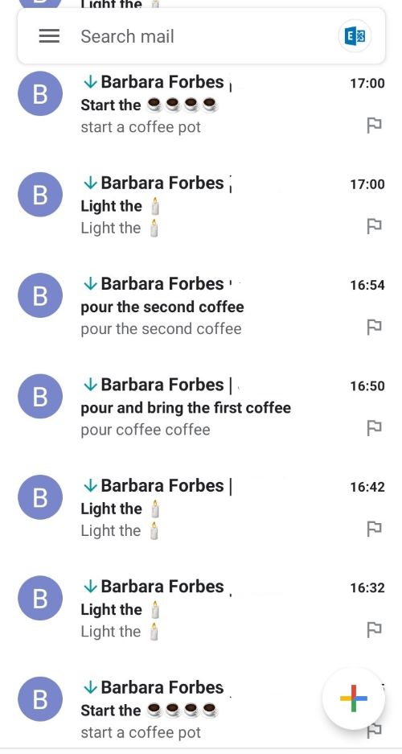
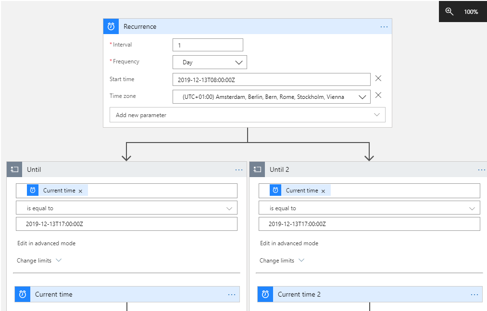

# 25daysofserverless Day 2

## The logic app

I went with a logic app for this challenge.

The timer is triggered once at the relevant time (although a http trigger would work as well, as it only needs a boot).
After that, I have created two parallel branches with delays in them. One is for the candles, one for the coffee. After 17h the messages are stopped as Lucy could probably use some rest.  
There are definitely more ways to approach this, this felt the cleanest to me.

All the notifications are emails, as you can see here

## the files
In this repository, I have left a few files. I have mostly used the designer to create the logic app. It works basically like this:

 

Next to that, I have 3 files:

- 4besday2.definition.json
- and 4besday2.parameters.json are the files VSCode generates when using the Azure LogicApp extension (which are a bit silly to be honest)
- Codeview.json is the view of the logic app if you choose "logic app code view' in the portal

## Blog posts on logic apps

I have written two blog posts on logic apps:
<https://4bes.nl/tag/logic-app/>

## The Challenge

### Lucy's Dilemma!

*Monday, 2 December 2019*  
Today we find ourselves in Stockholm, where a little girl named Lucy needs our help!

Every December 13th, Lucy is tasked with wearing a crown with six lit candles and delivering coffee to all of her family members — her mother, father, sister, and brother. Each candle only lasts ten minutes before burning out, and she needs to be careful to keep the candles lit during the delivery time!

Lucy is somewhat forgetful, though, and the stolen servers mean Lucy's usual reminder app isn't working! With only a few weeks to go before her big night, Lucy is worried how she'll remember everything she needs to do and keep her timing in order. She thought about using sticky notes with color codes to remind her of the things she needs to do, but what if they get mixed up? How can she optimize her tasks using serverless technology?

t takes Lucy 25 minutes to make a large pot of coffee that will serve everyone, and about four minutes to deliver two cups of coffee (remember that she only has two hands to deliver them!). As mentioned, the candles will need to be relit every ten minutes.

Create a task scheduler that will tell Lucy exactly when she should relight candles, pour coffee into cups, and deliver batches of coffee. How you want to notify Lucy is up to you: maybe you can send her an SMS via Twilio, or build a webapp that uses WebSockets and browser notifications?

Tips
Take a look at the Task Scheduler in the Azure Portal. It's been deprecated in favor of creating a Logic App, so you might use that. According to the challenge, we have to set several tasks to be scheduled on December 13th. Let's say we start at 8AM, Stockholm time. It might help to sketch out the schedule of tasks to be done:

8:00 AM - start the coffee, set out 4 cups
8:25 AM - pour two cups

8:30 AM - light the candles

8:35 AM - deliver the coffee to Mom and Dad
8:39 AM - return to kitchen, fill two more cups

8:40 AM - relight the candles

8:45 AM - deliver the coffee to Sister and Brother
8:49 AM - return to kitchen, take a break!

## More information

Barbara Forbes  
@Ba4bes  
[4bes.nl](https://4bes.nl)  
