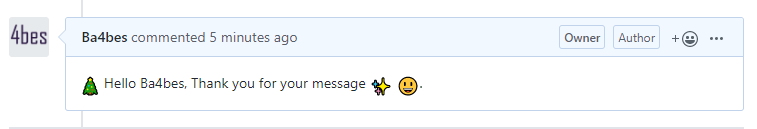

# 25daysofserverless Day 8

## Process

Azure Function App

This is a PowerShell Function App.
It gets triggered by a github webhook and talks to the Github API.
Of course it used emojis, because that makes everything better. 

## Call the function

Want to see the function in action? Submit an issue at <https://github.com/Ba4bes/25daysofserverless>

## The Challenge

### Ebenezer Scrooge

*Monday, 9 December*  
Bah humbug! Ebenezer Scrooge is miserable this holiday season. He never says thank you and this makes everyone sad, even Scrooge. Let's lift his spirits by saying thank you to everyone who contributes to his OSS projects on GitHub.

Do you feel good when someone says "thank you" when you contribute to a GitHub project? Let's use some holiday magic and serverless to automate this! After all, the holiday season is a time for smiling more and taking the time to say thank you to those around us.

We challenge you to automate creating a holiday themed "thank you" with serverless that replies to all issues created in one or more of your GitHub repositories

Say Happy Holidays in GitHub Issues

You can use any technologies you prefer to solve this challenge.

Show us what you can build and join our Days of Serverless, with Challenge 9.

Enjoy your challenge and Happy Holidays!

## More information

 This site is running on an Azure Function App with PowerShell. Want to find out more about creating your own? Click [here]('https://4bes.nl/MSIgnite')

Barbara Forbes  
[@Ba4bes](https://www.twitter.com/ba4bes)  
[4bes.nl](https://4bes.nl)  

