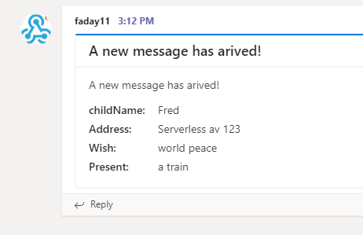

# 25daysofserverless Day 11

## Azure Function App

**Update**: I have cleaned up the code. [Click here for the original submission](https://github.com/Ba4bes/25daysofserverless/tree/5f716cabfa2fd5309078f77e105013fa82cc160d/Day11WishMaster2000)

Well here we go combining all the skills :-D
I did an Azure Function App (PowerShell of course) talking to a CosmosDB, like on [Day 4](../Day4potluck/readme.md). Combine that with the form and results like on [Day 7](../Day7Pictures/Readme.md). Finally, the messaging to Teams, like in [Day 6](../Day6Sinterklaas/Readme.MD). The new thing of the day was using the Database as a trigger, which wasn't too hard.

The app can be called here <https://4besday11.azurewebsites.net/api/FrontPage>

The message in Teams that follows:

## The Challenge

### Wishmaster 2000

*Wednesday, 11 December*
It's that time of the year when all children start wishing for something amazing to end up in their stocking!

After last week's challenge, Santa's servers are completely overwhelmed with requests from children!

To help him handle the load, your challenge today is to build him a system that takes in childrens' requests and stores them for later processing. Additionally, he wants his elves to be notified every time a new gift wish arrives. If each new wish was published to something like Slack or Microsoft Teams, that would be super helpful in keeping his elves on top of all the requests!

Santa needs an endpoint that receives data in this format:

a description of the wish
who it's from
address
type of present (e.g toy, clothes, animal etc..)
Santa should be able to query that database on his own (he's a bit of a micromanager — this helps keep him off the elves' back!), as well as having a message get posted to Slack or another chat service whenever data is added to the database.

As a bonus challenge: kids would love a nice UI to input their wishes. Help them by building a webpage with a form that submits data in the previous format!

## More information

 This app is running on an Azure Function App with PowerShell. Want to find out more about creating your own? Click [here]('https://4bes.nl/MSIgnite')

Barbara Forbes  
[@Ba4bes](https://www.twitter.com/ba4bes)  
[4bes.nl](https://4bes.nl)
