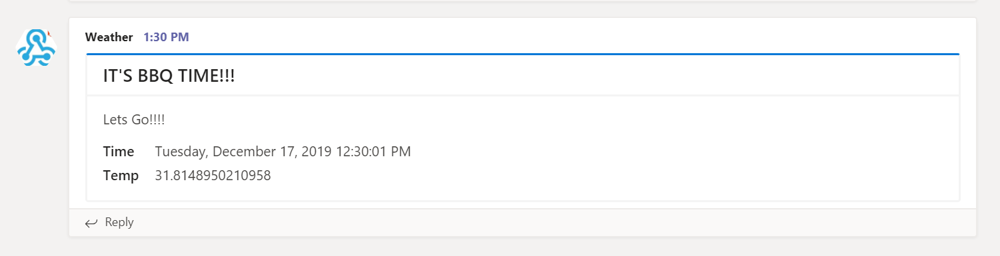

# 25daysofserverless Day 17

## Azure Function App

The challenge asks for a python function app, but I don't think anyone is surprised that I used PowerShell :).  
I must admit I think a logic app is far easier for this use case. But I do want to know how to make a Raspberry pi talk with a function app.  
So I went ahead and created an IOThub and got the simulation to work.
The raspberry pi creates an event hub messages, which triggers the Function App.

I didn't have the time to wait for a twitter developer account and I don't really want to do that with my main account.
(I think this would have been possible with logic app though). So instead the function posts a message to Teams.

## The Challenge

### Time for an Australian Christmas day BBQ on the beach

*Tuesday, 17 December*  
Time for an Australian Christmas day BBQ on the beach
Skippy the Kangaroo and his mates, Kenny the Koala and Willy the Wombat, were very excited and looking forward to Christmas.

"Only a week to go!" said Kenny the Koala, "and I've been very good all year!"

Skippy and Willy looked at each other and rolled their eyes. "You haven't been THAT good," they thought. Skippy reminded his mates, "it’s not all about presents! My favourite part of Christmas is going to the beach, firing up the BBQ, having a nice cold beer, and relaxing with my friends and family. Let’s hope it's a sunny day!".

Your challenge is to build Skippy and his friends an Internet of Things system that helps let them know if it's a warm day at the beach. They want someting that can send them a tweet if it's currently warmer than 31°C (88° Fahrenheit) so they know whether or not to head all the way out to the beach for a truly Australian Christmas Day!

A tip: if you don't want to pull out a physical IoT device, you may want to use the Raspberry Pi Simulator to connect to the Azure IoT Hub.

## More information

 This app is running on an Azure Function App with PowerShell. Want to find out more about creating your own? Click [here]('https://4bes.nl/MSIgnite')

Barbara Forbes  
[@Ba4bes](https://www.twitter.com/ba4bes)  
[4bes.nl](https://4bes.nl)
