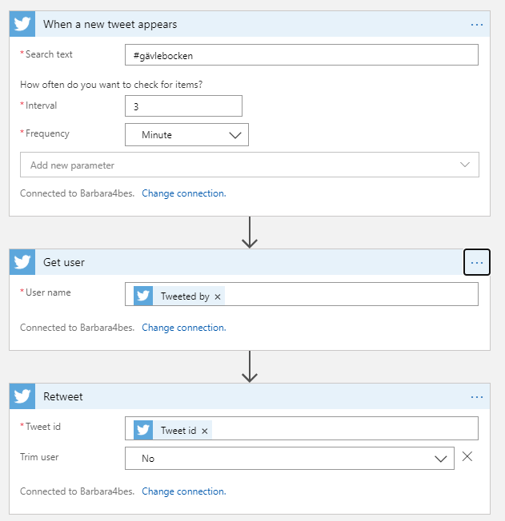
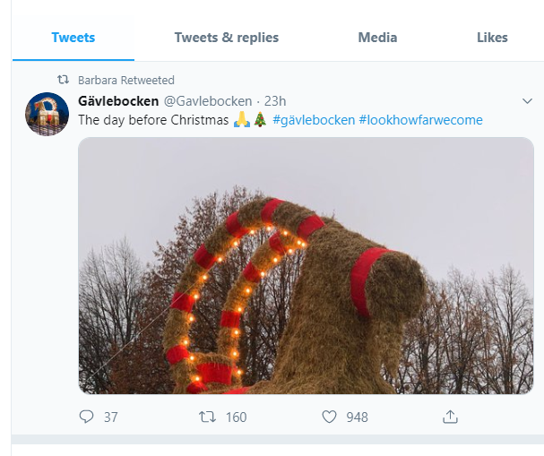

# 25daysofserverless Day 24

## Azure Logic App

So this in my opinion is easiest to do through an Azure Logic App.
Ther is no need for a Twitter developer account or keyvault.

I have made the connection to Twitter through the Logic App. It takes all tweets with Gavlebocken in them and retweets them.
The design looks like this

This results in tweets being retweeted as they appear
.

The connection in the logic app has it's own permission settings, so it can be very secure. Add on MFA and Privileged identity management and the risk is becoming very low!

Update 27/12:
I hadn't considered the risk of retweeting negative tweets :-o  
Luckily [Jennifer Davis](https://twitter.com/sigje) warned me for those.
So I have added a Cognitive services connection that checks the Sentiment of the tweet and only retweets positive tweets

## The Challenge

### Gävlebocken

*Tuesday, 24 December*  
Today, we're heading to Gävle, Sweden. Though its purpose has changed over the years, current tradition has the Yule Goat pulling Father Christmas' sled to deliver presents. Every year since 1966, the Gävle Goat representing the Yule Goat has been set up at the Castle Square in Gävle. Every year, other folks follow a tradition of trying to destroy the Yule goat. It has had tremendous difficulty making it through the Yuletide unscathed, so Father Christmas wants to increase awareness through a marketing campaign. He wants you to create a social media bot that will surface content tagged with #gävlebocken, or that is shared directly through the campaign.

The only problem is that just as with the naughty elves who try to destroy the physical Yule goat, there are malicious actors trying to hijack and manipulate this campaign of good will. Implement some security precautions to make sure that those naughty elves aren't successful with the campaign and protect the bot's integrity. Azure Functions and Cognitive Services might be helpful to you.

Depending on how you choose to implement the necessary functionality revisiting previous challenges may help:

Challenge 11: Database Trigger
Challenge 15: Cognitive Services
Challenge 16: Continuous Integration and Continuous Delivery
Challenge 21: Orchestrating stateful serverless functions
Challenge 22: Separation of secret configuration from code with Azure Key Vault

## More information

 This app is running on an Azure Function App with PowerShell. Want to find out more about creating your own? Click [here]('https://4bes.nl/MSIgnite')

Barbara Forbes  
[@Ba4bes](https://www.twitter.com/ba4bes)  
[4bes.nl](https://4bes.nl)
